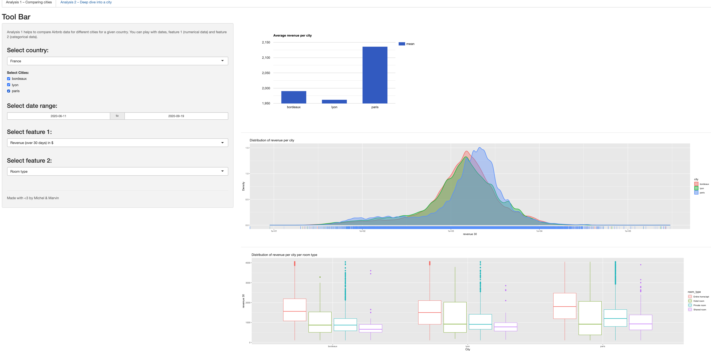
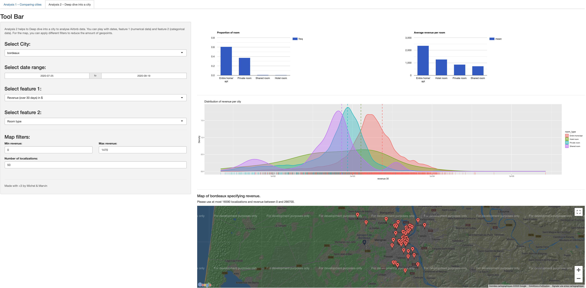

# Airbnb-Analysis-ShinyApp
R project for ECE Course DATA ANALYTICS WITH R 2020.
This project aims to build a shiny web app that provide garph and insights from scrapped airbnb data.
MARTIN MARVIN - MICHEL OMAR AFLAK


# Web App



# Run it!
```
library(shiny)
setwd("~/YOUR_PATH/Airbnb-Analysis-ShinyApp")
runApp(appDir = "shinyApp")
#or 
runGitHub("Airbnb-Analysis-ShinyApp", "MarvinMartin24", subdir = "shinyApp")
```
# Open it in your browser

````
http://127.0.0.1:5640
```` 
(Port might change, look at the console log)

# Details

It contains two tabs, one tab for analysis 1 that compares different cities with each other. Tab
2 that contains analysis 2 which deep dives into a selected city.
Data have been scrapped from the 3 latest scrapping date for each city at http://insideairbnb.com/get-the-data.html.
Have a lot at `data\all_data_urls.csv` where all the urls are stored.
We have applied preprocessing step to only be usefull information and computed some additional one, please look at `utils\tools.R`
The shiny app code is located in `shinyApp` where you can find the front-end (`ui.R`) and back-end (`server.R`).

Different graph are displayed: histgram, boxplot, density, map
Several features are selectable: 
  * Countries
  * Cities
  * Date range
  * feature 1 (numerical data like revenue, price, availability, ...)
  * feature 2 (categorical data like room type, number of bedrooms, neigboorhood, ...)
  * Map filter (min max of feature 1 and number of geopoints to display in the map

# Contribution
Thank you Maggie MHANNA, our teacher for supervising this project.
